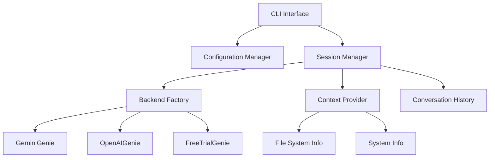

# Shell Genie Design Document

## Overview

The Shell Genie will be enhanced to support Google's Gemini Pro API as a backend option, alongside the existing OpenAI and free trial backends. The system will maintain the current architecture while adding conversational capabilities and improved context awareness. The design leverages the existing typer-based CLI framework and extends the backend abstraction pattern.

## Architecture

### High-Level Architecture



### Core Components

1. **Enhanced CLI Interface**: Extended typer application with conversational mode
2. **Gemini Pro Backend**: New backend implementation for Google's Gemini Pro API
3. **Session Manager**: Manages conversation state and history
4. **Context Provider**: Gathers system and file system context
5. **Configuration Manager**: Enhanced to support Gemini Pro API keys
6. **Conversation History**: Maintains session context for follow-up interactions

## Components and Interfaces

### 1. Enhanced Backend Interface

```python
class BaseGenie:
    def ask(self, wish: str, explain: bool = False, context: dict = None, history: list = None) -> tuple[str, str]
    def post_execute(self, wish: str, explain: bool, command: str, description: str, feedback: bool)
    def validate_credentials(self) -> bool
```

### 2. Gemini Pro Backend

```python
class GeminiGenie(BaseGenie):
    def __init__(self, api_key: str, os_fullname: str, shell: str)
    def _build_prompt(self, wish: str, explain: bool, context: dict, history: list) -> str
    def _make_api_request(self, prompt: str) -> dict
    def ask(self, wish: str, explain: bool = False, context: dict = None, history: list = None) -> tuple[str, str]
    def validate_credentials(self) -> bool
```

### 3. Session Manager

```python
class SessionManager:
    def __init__(self, genie: BaseGenie, context_provider: ContextProvider)
    def start_conversation(self)
    def process_input(self, user_input: str) -> str
    def add_to_history(self, role: str, content: str)
    def get_context(self) -> dict
    def should_execute_command(self, command: str) -> bool
```

### 4. Context Provider

```python
class ContextProvider:
    def get_current_directory(self) -> str
    def get_directory_contents(self, path: str = None) -> list
    def get_system_info(self) -> dict
    def get_environment_variables(self) -> dict
    def build_context(self) -> dict
```

### 5. Enhanced CLI Commands

- `shell-genie init`: Initialize configuration (enhanced to support Gemini Pro)
- `shell-genie ask <question>`: Single question mode (existing, enhanced with context)
- `shell-genie chat`: New conversational mode
- `shell-genie config`: Manage configuration settings

## Data Models

### Configuration Schema

```python
{
    "backend": str,  # "gemini-pro", "openai-gpt-3.5-turbo", "free-genie"
    "os": str,
    "os_fullname": str,
    "shell": str,
    "gemini_api_key": str,  # New field
    "openai_api_key": str,  # Existing
    "training-feedback": bool,  # Existing
    "conversation_history_enabled": bool,  # New
    "max_history_length": int,  # New
    "include_file_context": bool,  # New
    "dangerous_command_warnings": bool  # New
}
```

### Conversation History Schema

```python
{
    "session_id": str,
    "timestamp": datetime,
    "messages": [
        {
            "role": str,  # "user" or "assistant"
            "content": str,
            "timestamp": datetime,
            "context": dict  # Optional context snapshot
        }
    ]
}
```

### Context Schema

```python
{
    "current_directory": str,
    "directory_contents": list[str],
    "system_info": {
        "os": str,
        "shell": str,
        "python_version": str,
        "available_commands": list[str]
    },
    "environment": dict,
    "recent_commands": list[str]  # From shell history if available
}
```

## Error Handling

### API Error Handling

1. **Authentication Errors**: Clear messages for invalid API keys with setup guidance
2. **Rate Limiting**: Exponential backoff with user notification
3. **Network Errors**: Retry logic with timeout handling
4. **Malformed Responses**: Graceful parsing with fallback messages

### Command Safety

1. **Dangerous Command Detection**: Pattern matching for potentially harmful commands
2. **Confirmation Prompts**: User confirmation for destructive operations
3. **Execution Sandboxing**: Optional dry-run mode for command preview

### Session Management Errors

1. **History Corruption**: Graceful degradation with history reset option
2. **Context Gathering Failures**: Partial context with error logging
3. **Configuration Issues**: Clear error messages with repair suggestions

## Testing Strategy

### Unit Tests

1. **Backend Integration Tests**: Mock API responses for each backend
2. **Context Provider Tests**: File system and system info gathering
3. **Session Manager Tests**: Conversation flow and history management
4. **Configuration Tests**: Config validation and migration

### Integration Tests

1. **End-to-End CLI Tests**: Full command execution flows
2. **API Integration Tests**: Real API calls with test credentials
3. **Cross-Platform Tests**: OS and shell compatibility testing

### Security Tests

1. **API Key Storage Tests**: Encryption and secure storage validation
2. **Command Injection Tests**: Input sanitization verification
3. **File System Access Tests**: Context gathering permission checks

## Implementation Considerations

### Gemini Pro API Integration

- Use the official Google AI Python SDK
- Implement proper authentication with API key validation
- Handle Gemini-specific response formats and error codes
- Support for different Gemini models (pro, pro-vision if needed)

### Backward Compatibility

- Maintain existing CLI interface for single-question mode
- Preserve existing configuration format with extensions
- Keep existing backend implementations unchanged

### Performance Optimizations

- Cache system context to avoid repeated file system calls
- Implement conversation history pruning to manage memory
- Use async operations for API calls where beneficial

### Security Considerations

- Encrypt API keys in configuration storage
- Sanitize user input before sending to APIs
- Implement command validation before execution
- Provide clear warnings for potentially dangerous operations

### User Experience Enhancements

- Rich terminal formatting for better readability
- Progress indicators for API calls
- Contextual help and command suggestions
- Graceful handling of interruptions (Ctrl+C)